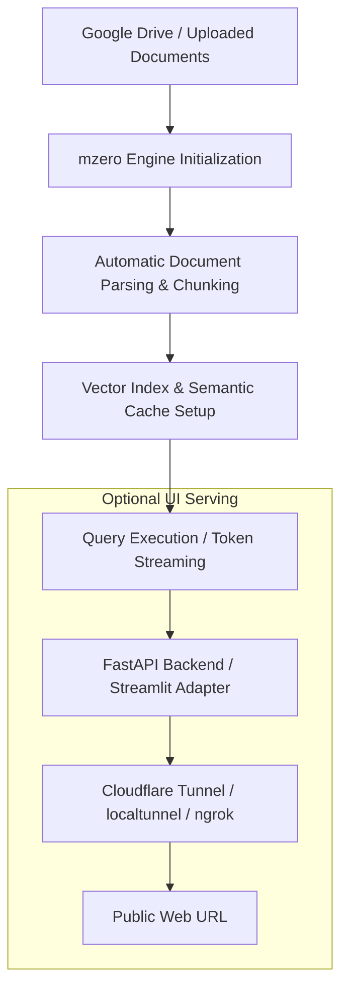

# Using mzero in Google Colab

This guide provides a step-by-step implementation process for running **mzero** inside Google Colab notebook environments. You can also open and run the pre-built notebook [mzero_colab_demo.ipynb](file:///d:/Github%20repo/advanced_rag_pipeline/mzero_colab_demo.ipynb) directly.

---

## Architecture Flow in Colab



---

## Step 1: Environment Setup & Dependency Installation

Run the following cell in your Google Colab notebook to install `mzero` along with optional framework support (such as Streamlit or vector storage drivers):

```bash
!pip install -q mzero[full]
```

Or if installing directly from the repository source:

```bash
!git clone https://github.com/bala-2305/advanced_rag_pipeline.git
%cd advanced_rag_pipeline
!pip install -q -e .[full]
```

---

## Step 2: Prepare Documents

### Option A: Upload Files Directly in Colab

Create a local `./docs` folder and upload sample PDF, DOCX, TXT, or Markdown documents:

```python
import os

# Create knowledge base folder
os.makedirs("./docs", exist_ok=True)

# Create a sample document for testing
with open("./docs/sample_policy.txt", "w") as f:
    f.write("""
    mzero Enterprise Knowledge Base Policy
    
    1. Returns and Refunds:
       Customers can request a full refund within 30 days of purchase.
       Items must be in original condition with proof of purchase.
    
    2. Warranty & Support:
       All hardware components carry a 2-year manufacturer warranty.
       Technical support is available 24/7 via support@mzero.ai.
    """)

print("Sample document created in ./docs/sample_policy.txt")
```

### Option B: Mount Google Drive

To use documents stored in your Google Drive:

```python
from google.colab import drive
drive.mount('/content/drive')

# Point docs path to your Drive folder
DOCS_PATH = "/content/drive/MyDrive/my_rag_documents"
```

---

## Step 3: Run RAG Queries

### Basic Single Question Query

```python
from mzero import RAG

# Initialize pipeline (automatically indexes documents in ./docs)
rag = RAG(docs_path="./docs")

# Ask a question
response = rag.ask("What is the refund period and warranty length?")

print("Answer:")
print(response.answer)
print("\nConfidence Score:", response.confidence)

print("\nCitations:")
for citation in response.citations:
    print(f"- File: {citation.source_file} (Score: {citation.score})")
    print(f"  Snippet: {citation.snippet}")
```

### Token Streaming Query

```python
from mzero import RAG

rag = RAG(docs_path="./docs")

print("Streaming Response: ", end="")
for token in rag.stream("How can I contact technical support?"):
    print(token, end="", flush=True)
print()
```

### Asynchronous Execution

```python
import asyncio
from mzero import AsyncRAG

async def run_colab_query():
    rag = AsyncRAG(docs_path="./docs")
    res = await rag.aask("Summarize the warranty details.")
    print("Async Answer:", res.answer)

# In Google Colab, use nest_asyncio or await directly in top-level cells
import nest_asyncio
nest_asyncio.apply()

await run_colab_query()
```

---

## Step 4: Expose Interactive Streamlit App in Colab

To launch the Streamlit chat UI inside Google Colab and expose it over a public URL using `localtunnel`:

### 1. Write the Streamlit App Script (`app.py`)

```python
%%writefile app.py
import streamlit as st
from mzero.adapters.streamlit import render_mzero_chat

st.set_page_config(page_title="mzero Colab Chat", layout="wide")

# Mount interactive chat UI
render_mzero_chat(docs_path="./docs")
```

### 2. Launch Streamlit with Tunnel in Colab

```bash
# Get your Colab public IP for localtunnel authentication password
!curl https://loca.lt/mytempip

# Run Streamlit in background and expose via localtunnel
!streamlit run app.py & npx localtunnel --port 8501
```

Click the `loca.lt` URL printed in the output and enter the IP address returned by `curl` to open the full interactive UI.

---

## Step 5: Advanced Pipeline Customization & Inspection

### Custom Configuration

```python
from mzero.config import Config
from mzero.core.pipeline import RAGPipeline

# Initialize custom configuration
config = Config(
    docs_path="./docs",
    embedding_model="bge-small-en-v1.5",
    vector_db_backend="faiss",
    top_k=5,
    enable_reranker=True,
    enable_semantic_cache=True
)

pipeline = RAGPipeline(config)

# Ingest and query
stats = pipeline.ingest()
print("Ingestion Stats:", stats)

result = pipeline.query("Explain return policy conditions")
print("Result Answer:", result.answer)
```

---

## Troubleshooting in Colab

1. **GPU Acceleration**: If using large embedding models or local LLMs, switch your Colab runtime to **GPU (T4)** via `Runtime > Change runtime type > T4 GPU`.
2. **Asynchronous Loops**: Google Colab runs an active event loop. If calling async functions, use `import nest_asyncio; nest_asyncio.apply()`.
3. **Memory Limits**: For large document collections, use `vector_db_backend="chroma"` or `vector_db_backend="faiss"` to maintain low RAM consumption.
