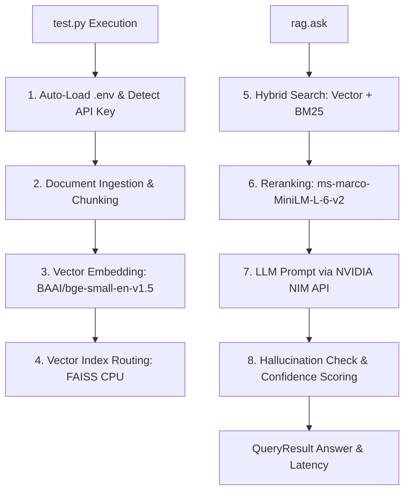

# mzero RAG Execution Flow & Model Mechanics

This guide explains what happens behind the scenes when executing the zero-configuration `mzero` pipeline using [test.py](file:///d:/Github%20repo/advanced_rag_pipeline/test.py).

---

## The Code Example

```python
from mzero import RAG

# Zero-configuration initialization: automatically loads .env and resolves NVIDIA_API_KEY
rag = RAG(docs_path="./docs")

# Ask question using knowledge base
result = rag.ask("What is your name?")

print("Answer:")
print(result.answer)
print(f"\nConfidence: {result.confidence}")
print(f"Latency: {result.latency_ms} ms")
```

---

## Which Model Replies to Your Messages?

When `mzero` detects `NVIDIA_API_KEY` in your `.env` file or environment variables, it automatically routes generation to:

- **LLM Provider**: **NVIDIA NIM**
- **LLM Model**: `meta/llama-3.1-70b-instruct` *(Hosted Llama 3.1 70B Instruct model)*

If you set `OPENAI_API_KEY`, `GEMINI_API_KEY`, or `ANTHROPIC_API_KEY` instead, `mzero` automatically switches to `gpt-4o-mini`, `gemini-1.5-flash`, or `claude-3-haiku-20240307` respectively.

---

## Step-by-Step Execution Mechanics



### 1. Auto-Loading & Provider Selection
`RAG(docs_path="./docs")` initializes the framework. It checks for local `.env` files, detects active API keys, and assigns the appropriate model provider (e.g. `NVIDIA NIM`).

### 2. Knowledge Base Inspection & FAISS Indexing
`mzero` scans the `./docs` directory for documents (`.md`, `.pdf`, `.docx`, `.py`, etc.).
- Changes or new files are chunked into semantic segments.
- Chunks are embedded using `BAAI/bge-small-en-v1.5`.
- Datasets under 50MB are stored in a high-speed **FAISS CPU** index.

### 3. Hybrid Retrieval & Reranking
When `rag.ask(...)` is called:
- Dense vector similarity and sparse **BM25** keyword search run simultaneously.
- Results are merged via **Reciprocal Rank Fusion (RRF)**.
- Top candidate chunks are re-scored using a **Cross-Encoder** (`ms-marco-MiniLM-L-6-v2`).

### 4. Generation & Grounding Check
- Context chunks and your question are structured into a prompt sent to `https://integrate.api.nvidia.com/v1/chat/completions`.
- `meta/llama-3.1-70b-instruct` generates the answer based on retrieved context.
- `mzero` computes token overlap confidence scores before returning the `QueryResult`.
