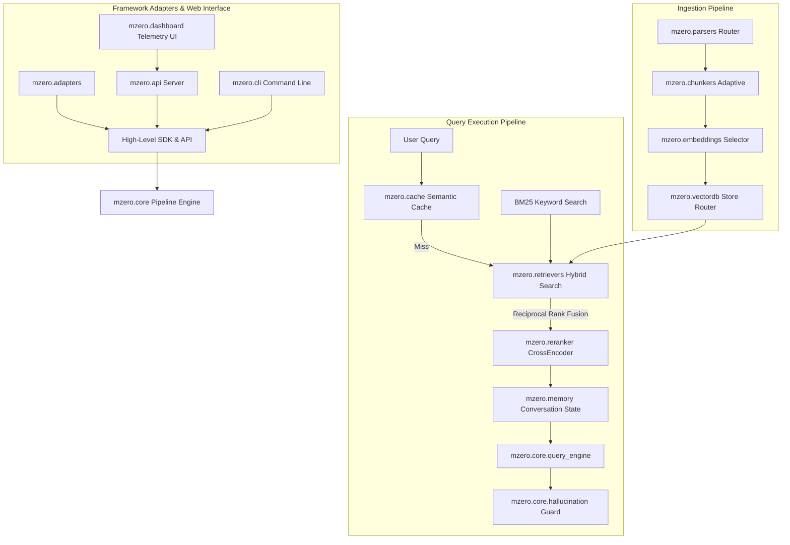

# mzero Module Architecture & Component Reference

This document provides a technical overview and module-by-module breakdown of the **mzero** framework codebase architecture.

---

## Architecture Overview



---

## Package Directory Structure

```mermaid
graph TD
    classDef rootStyle fill:#2b2d42,stroke:#8d99ae,stroke-width:2px,color:#edf2f4,font-weight:bold;
    classDef fileStyle fill:#1d3557,stroke:#457b9d,stroke-width:1px,color:#f1faee;
    classDef dirStyle fill:#3a5a40,stroke:#588157,stroke-width:1px,color:#dad7cd;

    Root["mzero/ Package Root"]:::rootStyle

    subgraph EntryPoints["Root Files & Schemas"]
        Root --> Init["__init__.py<br/>(Package exports)"]:::fileStyle
        Root --> Main["main.py<br/>(SDK Entry Points)"]:::fileStyle
        Root --> Config["config.py<br/>(Config & Environment)"]:::fileStyle
        Root --> Types["types.py<br/>(Pydantic Schemas)"]:::fileStyle
    end

    subgraph CoreEngine["Processing & Core Engine"]
        Root --> Core["core/<br/>(Pipeline Engine & Query Exec)"]:::dirStyle
        Root --> Parsers["parsers/<br/>(Document Parsers)"]:::dirStyle
        Root --> Chunkers["chunkers/<br/>(Adaptive Chunker)"]:::dirStyle
        Root --> Embeddings["embeddings/<br/>(Embedding Selectors)"]:::dirStyle
    end

    subgraph StorageRetrieval["Storage & Retrieval"]
        Root --> VectorDB["vectordb/<br/>(Faiss, Chroma, Qdrant)"]:::dirStyle
        Root --> Retrievers["retrievers/<br/>(Hybrid Dense + BM25)"]:::dirStyle
        Root --> Reranker["reranker/<br/>(CrossEncoder Reranker)"]:::dirStyle
        Root --> Cache["cache/<br/>(Semantic Cache)"]:::dirStyle
        Root --> Memory["memory/<br/>(Conversation Memory)"]:::dirStyle
    end

    subgraph InterfacesAdapters["Interfaces & Utilities"]
        Root --> Adapters["adapters/<br/>(FastAPI, Streamlit, etc.)"]:::dirStyle
        Root --> API["api/<br/>(FastAPI Server)"]:::dirStyle
        Root --> CLI["cli/<br/>(Terminal CLI)"]:::dirStyle
        Root --> Dashboard["dashboard/<br/>(Telemetry Web UI)"]:::dirStyle
        Root --> Utils["utils/<br/>(SHA-256, Logger, Search)"]:::dirStyle
    end
```



```
mzero/
├── __init__.py           # Package exports (RAG, AsyncRAG, Config)
├── main.py               # SDK entry point wrappers (RAG, AsyncRAG)
├── config.py             # Config object schema & runtime environment settings
├── types.py              # Pydantic data schemas (Document, Chunk, QueryResult, Citation)
├── core/                 # Orchestration pipeline engines & query execution logic
├── parsers/              # Multi-format document parsing & router handlers
├── chunkers/             # Domain-adaptive text chunking strategies
├── embeddings/           # Embedding model selector & provider abstractions
├── vectordb/             # Vector database router & store implementations
├── retrievers/           # Hybrid retriever (Dense + BM25 + Reciprocal Rank Fusion)
├── reranker/             # Cross-Encoder rank refinement engine
├── memory/               # Conversation history and window memory management
├── cache/                # Semantic caching layer using vector cosine similarity
├── adapters/             # Integration wrappers (FastAPI, Streamlit, LangChain, LlamaIndex, Flask)
├── api/                  # FastAPI server endpoints (/ask, /stream, /stats)
├── cli/                  # Command-line interface definitions (mzero ask, serve, index)
├── dashboard/            # Telemetry HTML/JS dashboard static web assets
└── utils/                # SHA-256 state tracking, logger, and web search fallbacks
```

---

## Component & Module Breakdown

### 1. `mzero.main` & `mzero.config`
- **`mzero.main`**: Provides high-level Python SDK entry points (`RAG` and `AsyncRAG`). Acts as a developer-facing wrapper around `RAGPipeline`.
- **`mzero.config`**: Defines the `Config` data model containing settings for document paths, embedding models, vector store backends, chunk sizes, top-k parameters, and feature toggles.
- **`mzero.types`**: Declares standard Pydantic types (`Document`, `Chunk`, `QueryResult`, `SearchResult`, `Citation`, `SystemStats`) used across internal data transfer boundaries.

---

### 2. `mzero.core` (Pipeline Orchestration)
- **`mzero.core.pipeline` (`RAGPipeline`)**: The main execution engine coordinating parsing, indexing, caching, hybrid retrieval, reranking, and generation.
- **`mzero.core.query_engine` (`QueryEngine`)**: Manages model prompts, context assembly from retrieved chunks, and generation of response answers.
- **`mzero.core.hallucination` (`HallucinationChecker`)**: Evaluates grounding ratio scores comparing generated text tokens against retrieved source context. Triggers fallback flags if grounding fails verification thresholds.

---

### 3. `mzero.parsers` (Document Ingestion)
- **`DocumentParserRouter`**: Inspects file extensions and MIME types to route files to specialized parser handlers:
  - `PDFParser`: Text & structural extraction from PDF documents.
  - `DocxParser`: Microsoft Word file parser.
  - `CodeParser`: AST and language-aware syntax parser for Python, JS, TS, Java, C++, Go, and Rust.
  - `WebParser`: HTML scraping and web content conversion.
  - `OCRParser`: Image text recognition via Tesseract OCR.
  - `YouTubeParser`: Transcript extraction for YouTube video URLs.

---

### 4. `mzero.chunkers` (Context Splitting)
- **`AdaptiveChunker`**: Selects context division strategy based on document content classification:
  - `ASTChunker`: Code structure chunking respecting function and class boundaries.
  - `MarkdownHeaderChunker`: Document hierarchy splitting based on `#`, `##`, `###` headers.
  - `SentenceWindowChunker`: Sliding window text chunking for narrative prose and books.
  - `FAQChunker`: Question-answer pair extraction splitting.

---

### 5. `mzero.embeddings` (Vector Embeddings)
- **`EmbeddingSelector`**: Automates model selection based on content classification (general English, multilingual, biomedical, source code):
  - Local model providers using HuggingFace / SentenceTransformers (`bge-small-en-v1.5`, `bge-m3`).
  - Remote cloud model abstractions (OpenAI, Cohere) when API keys are configured.

---

### 6. `mzero.vectordb` (Vector Storage Engine)
- **`VectorDBRouter`**: Dynamic database routing based on corpus size and environment availability:
  - **`FaissVectorStore`** (`mzero.vectordb.faiss_store`): In-memory CPU FAISS index for lightweight local execution (<50MB).
  - **`ChromaVectorStore`** (`mzero.vectordb.chroma_store`): Embedded ChromaDB database store (<1GB).
  - **`QdrantVectorStore`** / **`MilvusVectorStore`**: Distributed vector database drivers for enterprise datasets (>1GB).

---

### 7. `mzero.retrievers` & `mzero.reranker`
- **`HybridRetriever`**: Performs simultaneous dense vector search and sparse BM25 keyword matching, merging results using Reciprocal Rank Fusion (RRF).
- **`CrossEncoderReranker`**: Re-scores top hybrid candidate chunks using a cross-encoder transformer model to refine final rank precision before LLM generation.

---

### 8. `mzero.cache` & `mzero.memory`
- **`SemanticCache`**: Stores previous query-response pairs. Compares incoming query embeddings against cached query vectors using cosine similarity; returns cached results instantly if similarity exceeds threshold (e.g. >=0.92).
- **`ConversationMemory`**: Maintains sliding window conversation turn history across query iterations.

---

### 9. `mzero.adapters` (Framework Integration)
- **`mzero.adapters.streamlit`**: `render_mzero_chat()` helper for embedding interactive chat interfaces into Streamlit dashboards.
- **`mzero.adapters.fastapi`**: `mount_mzero()` utility mounting REST API routes onto existing FastAPI applications.
- **`mzero.adapters.langchain`**: Custom retriever wrapper for LangChain pipelines.
- **`mzero.adapters.llamaindex`**: Index wrapper for LlamaIndex queries.
- **`mzero.adapters.flask`**: Blueprint adapter for Flask web apps.

---

### 10. `mzero.api`, `mzero.cli`, & `mzero.dashboard`
- **`mzero.api`**: FastAPI app implementation exposing endpoints (`POST /ask`, `GET /stream`, `GET /stats`).
- **`mzero.cli`**: Click CLI script exposing `mzero ask`, `mzero serve`, and `mzero index` terminal commands.
- **`mzero.dashboard`**: Single-page telemetry dashboard displaying query latency, cache hit ratios, active memory, and index status.

---

### 11. `mzero.utils`
- **`IncrementalTracker`**: Manages SHA-256 hashes of input files to enable incremental indexing, avoiding redundant re-indexing of unchanged files.
- **`WebSearchFallback`**: Web search execution module triggered when document context is insufficient or unverified.
- **`Logger`**: Structured logging module.
