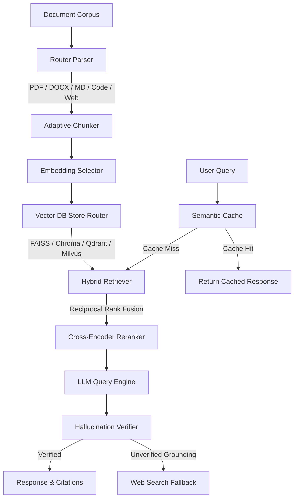

# mzero: Zero-Configuration RAG Framework

[](https://opensource.org/licenses/MIT)
[](https://www.python.org/downloads/)
[](https://fastapi.tiangolo.com/)
[](https://streamlit.io/)

**mzero** is a zero-configuration Retrieval-Augmented Generation (RAG) framework and embeddable Python SDK. It abstracts document ingestion, domain-aware chunking, dynamic vector store routing, hybrid dense/sparse search, cross-encoder reranking, conversation state management, and hallucination verification behind a minimal single-line interface.

```python
from mzero import RAG

rag = RAG("./docs")
print(rag.ask("Explain the refund policy"))
```

---

## Architecture Flow



---

## Core Specifications & Features

- **Zero Configuration Setup**: Automatic runtime initialization of storage, indexes, and model pipelines based on directory inspection.
- **Smart Multi-Format Parsing**: Built-in support for PDF, DOCX, TXT, MD, HTML, CSV, JSON, XML, PPTX, Source Code ASTs, Web Pages, OCR Images, and YouTube transcripts.
- **Adaptive Chunking**: Domain-aware context splitting for structured manuals, AST-based source code parsing, legal contracts, research papers, and FAQ structures.
- **Content-Aware Embedding Selector**: Automatic model selection (BGE, BGE-M3, Code-specialized, Bio-medical, or Cloud API models) matching input context language and domain.
- **Dynamic Vector DB Routing**: Automatic tier assignment:
  - FAISS CPU for lightweight local datasets (<50MB)
  - ChromaDB for medium local stores (<1GB)
  - Qdrant or Milvus for large-scale distributed deployments (>1GB)
- **Hybrid Dense & Sparse Search**: Reciprocal Rank Fusion (RRF) combining dense vector search and BM25 sparse keyword matching, followed by Cross-Encoder reranking.
- **Incremental Indexing Engine**: Incremental document delta tracking using SHA-256 signatures to update modified files without full re-indexing.
- **Hallucination Verification & Web Fallback**: Grounding verification scoring model calculating source token overlap, triggering optional web search fallback when verification drops below threshold.
- **Embeddable Framework Adapters**: Native integration adapters for FastAPI, Streamlit, LangChain, LlamaIndex, and Flask applications.

---

## Installation & Setup

```bash
pip install mzero
```

To include framework optional dependencies (e.g. Streamlit, vector storage backends):

```bash
# Install with Streamlit support
pip install mzero[streamlit]

# Install full enterprise bundle
pip install mzero[full]
```

### Google Colab Guide

For step-by-step instructions on running `mzero` inside Google Colab (including Google Drive mounting, token streaming, and exposing Streamlit via localtunnel), see [COLAB_README.md](file:///d:/Github%20repo/advanced_rag_pipeline/COLAB_README.md).

---

## API Reference & SDK Usage

### Synchronous SDK Usage

```python
from mzero import RAG

# Initialize pipeline pointing to knowledge base directory
rag = RAG(docs_path="./docs")

# Single question retrieval and generation
response = rag.ask("What is the warranty coverage period?")

print("Answer:", response.answer)
print("Confidence Score:", response.confidence)
print("Citations:", response.citations)

# Streaming token response
for token in rag.stream("Summarize section 4 of the documentation"):
    print(token, end="", flush=True)
```

### Custom Provider & API Key Configuration

You can easily instantiate `RAG` with any document folder and API key from any LLM provider (OpenAI, Gemini, NVIDIA, Anthropic, Groq, OpenRouter, etc.), passed directly or resolved automatically from environment variables:

```python
from mzero import RAG

# 1. Direct Initialization with explicit API Key
rag = RAG(
    docs_path="./my_documents",
    llm_provider="openai",        # "openai", "nvidia", "gemini", "anthropic", "groq", "openrouter"
    llm_model="gpt-4o-mini",
    api_key="sk-..."
)

# 2. NVIDIA NIM Example
rag_nvidia = RAG(
    docs_path="./my_documents",
    llm_provider="nvidia",
    llm_model="meta/llama-3.1-70b-instruct",
    api_key="nvapi-..."
)

# 3. Provider specified, API key automatically pulled from environment variable (e.g. GEMINI_API_KEY)
rag_gemini = RAG(
    docs_path="./my_documents",
    llm_provider="gemini"
)

# 4. Zero-config auto-detection (Detects provider & key automatically from environment)
# Scans environment for OPENAI_API_KEY, GEMINI_API_KEY, NVIDIA_API_KEY, ANTHROPIC_API_KEY, GROQ_API_KEY, etc.
rag_auto = RAG(docs_path="./my_documents")
```

### Asynchronous SDK Usage

```python
import asyncio
from mzero import AsyncRAG

async def run_query():
    rag = AsyncRAG(docs_path="./docs")
    response = await rag.aask("How do I initiate a return?")
    print("Answer:", response.answer)

asyncio.run(run_query())
```

---

## Framework Integration Adapters

### Streamlit Integration

Embed an interactive chat UI into any existing Streamlit application.

```python
import streamlit as st
from mzero.adapters.streamlit import render_mzero_chat

st.set_page_config(page_title="mzero Knowledge Base", layout="wide")

# Mount interactive chat component bound to local documents
render_mzero_chat(docs_path="./docs")
```

Run the Streamlit application:

```bash
streamlit run app.py
```

### FastAPI Integration

Mount `mzero` endpoints directly onto a FastAPI app instance:

```python
from fastapi import FastAPI
from mzero.adapters.fastapi import mount_mzero

app = FastAPI(title="Knowledge Base Service")

# Mount /ask, /stream, and /stats endpoints
mount_mzero(app, docs_path="./docs")
```

---

## CLI & Telemetry Dashboard

### Start API Server & Telemetry Dashboard

```bash
mzero serve --port 8000
```

Access the built-in live telemetry dashboard at:
`http://localhost:8000/dashboard`

### CLI Direct Query

```bash
mzero ask "What are the API rate limits?" --docs ./docs
```

---

## Documentation & AI Context

- **Module Architecture Reference**: For a technical breakdown of every package module, parser, chunker, vector DB router, and retriever, see [MODULES.md](file:///d:/Github%20repo/advanced_rag_pipeline/MODULES.md).
- **AI Agent Context & SDK Reference Guide**: For feeding AI assistants (ChatGPT, Claude, Gemini, Cursor, Antigravity) with precise SDK specs, schemas, and rules, see [AI_README.md](file:///d:/Github%20repo/advanced_rag_pipeline/AI_README.md) and [AGENTS.md](file:///d:/Github%20repo/advanced_rag_pipeline/AGENTS.md).

---

## License

MIT License.
